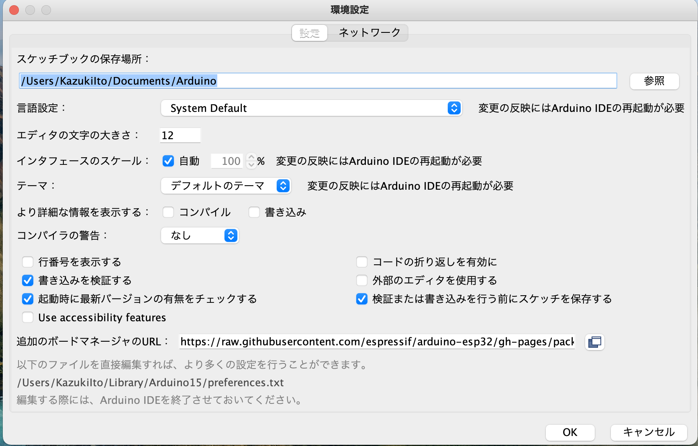
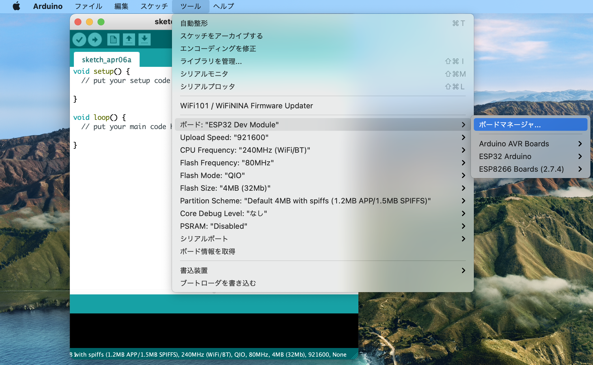
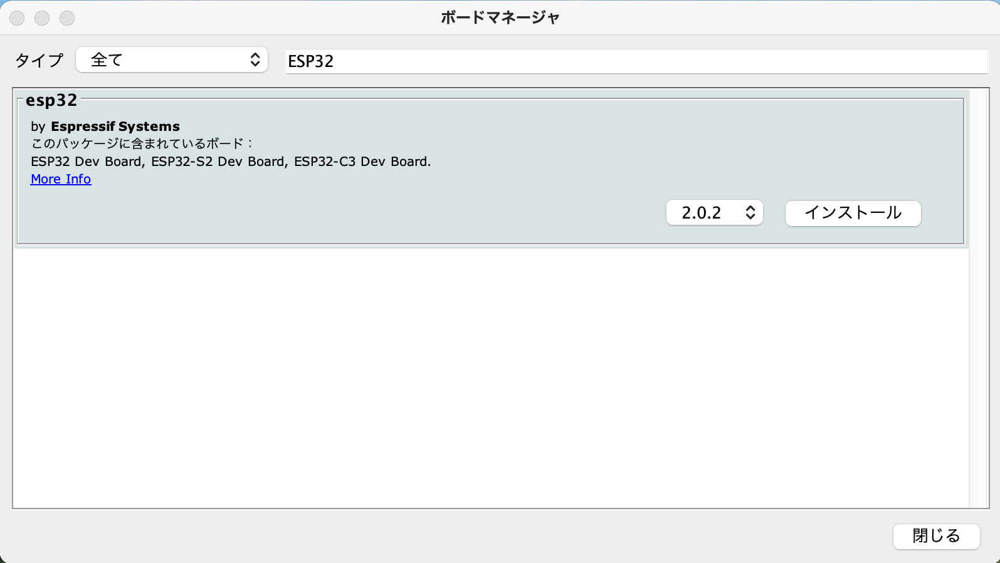
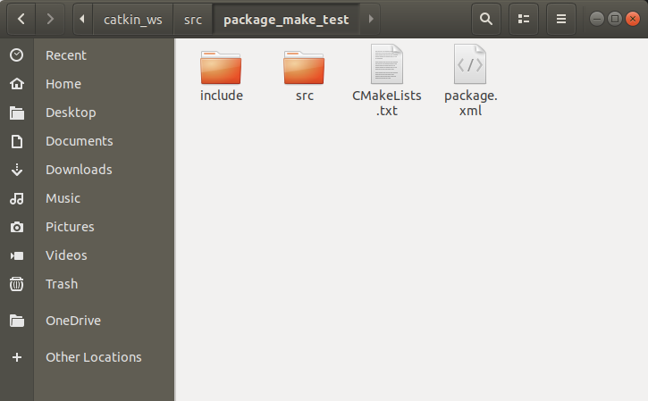
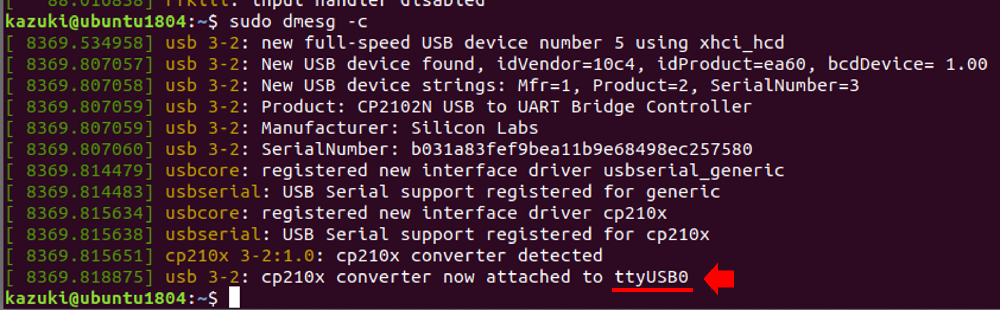
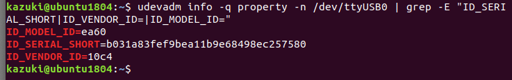

# ros1_with_esp32

本パッケージは，ROS1とESP32を組み合わせて，センサ情報の収集やモータ制御を伴うロボットシステムを構築する基本的なサンプルとチュートリアルを提供するものである．  
このパッケージを使うためには，Ubuntu 18.04 LTS が実行できるPC（MacやWindows上で仮想環境も可)とEspressif Systems社のESP32マイコンが必要である． 


チュートリアルには以下のものが必要．
- Ubuntu 18.04LTSを実行可能なパソコン(仮想環境も可)  
- ESP32マイコン(Espressif Systems, ESP32-DevKitC-32Eを推奨)   
    > https://www.espressif.com/en/products/devkits/esp32-devkitc   
- ポテンショメータ  
- DCモータ(ロータリーエンコーダ付きを推奨)  
    > https://www.amazon.co.jp/dp/B07KFZ4M2M  
- DCモータモータドライバ  
- 5V => 3.3V レベルコンバータ  
    > https://www.switch-science.com/catalog/1523/  
- Wi-FiアダプタもしくはLANアダプタ(仮想環境を用いる場合)  

# 初期設定
1. ubuntu 18.04 LTSがインストールされたパソコン(仮想環境も可)を用意  
    仮想環境を用いる場合はWindowsではvmware workstation player，macではvmware fusion playerなどのアプリケーションが必要となる．
<<<<<<< HEAD
    また，ESP32をWi-Fi経由で仮想環境上のubuntuで動くrosと通信させる場合は，仮想環境を運用するホストPCがもつイーサネットやWi-Fiとは別にもう一つネットワークアダプタを用意すると便利である．
    Ubuntuの仮想環境の準備については，本パッケージ内の[Ubuntuの仮想環境をつくる](documents/ubuntu_venv_setup.md)を参照して欲しい．  
=======
    また，仮想環境上のubuntuで動くrosとESP32をWi-Fi経由で通信させる場合は，仮想環境を運用するホストPCがもつイーサネットやWi-Fiとは別にもう一つネットワークアダプタを用意すると便利である．
    Ubuntuの仮想環境の準備については，本パッケージのdocuments/ubuntu_venv_setup.mdを参照して欲しい．  
>>>>>>> origin/main

2. ros1 melodicをインストール  
    > http://wiki.ros.org/melodic/Installation/Ubuntu  

3. ros1のコンパイラであるcatkinでROSのパッケージをコンパイルするためのcatkin workspaceの作成  
    > http://wiki.ros.org/ja/catkin/Tutorials/create_a_workspace  

4. Ubuntuのターミナルでcatkin workscape内でコンパイルしたパッケージを有効にする
    ```
    $ echo "source ~/catkin_ws/devel/setup.bash" >> ~/.bashrc
    ```
    > http://wiki.ros.org/ja/ROS/Tutorials/InstallingandConfiguringROSEnvironment

5. catkin workspace内にこのパッケージをclone
    ```
    $ cd ~/catkin_ws/src
    $ git clone git@github.com:110kazuki/ros1_with_esp32.git
    ```

6. rosserialのインストール  
    ```  
    $ sudo apt-get install ros-melodic-rosserial
    $ sudo apt-get install ros-melodic-rosserial-arduino
    ```

7. Arduino IDEをインストール  
    Arduinoの開発環境を準備する． 
    以下のページからUbuntu用のインストローラをダウンロードする．  
    > https://www.arduino.cc/en/software  
    
    ダウンロードされた圧縮ファイル(arduino-x.x.xx-linux64.tar.xz/arduino-x.x.xx)をhomeフォルダに解凍し，フォルダ名を分かりやすいように"arduino_ide"に変更しておく．

8. ESP32を使うためのArduinoライブラリをインストール  
    公式チュートリアルを参考にインストールを行う．
    > https://docs.espressif.com/projects/arduino-esp32/en/latest/installing.html  

    Arduino IDEの[Arduino]タブ内の環境設定を開き, [追加のボードマネージャーのURL]に以下のURLを入力し[OK]をクリックする.  
    
    ```
    https://raw.githubusercontent.com/espressif/arduino-esp32/gh-pages/package_esp32_index.json
    ```  
    続いて，[ツール]>[ボード:...]>[ボードマネージャ...]の順にクリックし，ボードマネージャを開く．
    

    検索タブに"esp32"と入力し，Espressif Systemsのesp32の最新バージョンをインストールする．  
      

    最後に, [ツール]>[ボード:...]>[ESP32 Arduino]>[ESP32 Dev Module]を選択することで，Arduino IDEでESP32の開発を行うことができるようになる．


9. arduino用のros1ライブラリ(ros_lib)をコンパイル  
    ターミナルを2つ使用  
    ターミナル①  
    ```
    $ roscore
    ```
    ターミナル②  
    ```
    $ mkdir ~/arduino_ros_lib
    $ cd ~/arduino_ros_lib
    $ rosrun rosserial_arduino make_libraries.py .
    ```
    ~/arduino_ros_lib/ に新たにros_libというフォルダが作成される．
    このフォルダ内にArduino用の様々なパッケージで使用されるメッセージのヘッダーファイルが保存されている．

10. コンパイルしたros_libをarduino IDEのlibrariesディレクトリ内にコピー  
    ```
    cp -r ~/arduino_ros_lib/ros_lib ~/arduino_ide/libraries/
    ```
    
    ubuntu以外の環境でArduino IDEを使う場合はros_libフォルダを以下のディレクトリにコピーする．
    windows  
    ```
    arduino IDEがインストールされたディレクトリ(Program files(x86など)/Arduino/libraries/~
    ```

    mac
    ```
    Applications/Arduino/Contents/Java/libraries/~
    ```

# パッケージの作成とコンパイル　　 
パッケージとは，ROSのコードを構成するソフトウエア構造の1単位である．各パッケージにはライブラリ、実行ファイルやスクリプト等が含まれる．  
>  http://wiki.ros.org/ja/ROS/Tutorials/NavigatingTheFilesystem  

パッケージのひな型はcatkinのコマンドを使って作成することができるが，プログラム内で使うライブラリにあわせてCMakeList.txt，package.xmlを編集する必要がある．
CMakeList.txt，package.xmlに関してはこちらの記事がわかりやすくまとめられている．
> https://qiita.com/srs/items/30c81c3f26f1987b0afa

- パッケージの構成  
&emsp;package/  
&emsp;&emsp;├ package.xml (http://wiki.ros.org/catkin/package.xml)  
&emsp;&emsp;├ CMakeList.txt (http://wiki.ros.org/action/show/rosbuild/CMakeLists?action=show&redirect=CMakeLists)  
&emsp;&emsp;├ include/    
&emsp;&emsp;│&emsp;└ source folder for header file (.h)  
&emsp;&emsp;├ src/  
&emsp;&emsp;│&emsp;└ source folder for C++ nodes (.cpp)  
&emsp;&emsp;├ scripts/    
&emsp;&emsp;│&emsp;└ source folder for Python nodes (.py)  
&emsp;&emsp;├ msg/  
&emsp;&emsp;│&emsp;└ message files (.msg)  
&emsp;&emsp;└ launch/  
&emsp;&emsp;　&emsp;└ launch files (.launch)

- パッケージの作成  
    `catkin_create_pkg`コマンドを使ってパッケージの雛形を作成する．パッケージは先に作成したcatkin workspace 内のソースファイルフォルダ `~/catkin_ws/src` に作成する．

    ```
    $ catkin_create_pkg [package名] [依存パッケージ1] … [依存パッケージN]
    ```
    依存パッケージには，'std_msgs','rospy','roscpp'　などのrosの機能を使うためのライブラリを記述する．
    そのほかにも，pythonやC++のスクリプト内で使用するライブラリなどを記述しておくと良い．

    以下のコマンドで，試しにpackage_make_testという名前のパッケージを作成してみる．
    ```
    $ cd ~/catkin_ws/src
    $ catkin_create_pkg package_make_test std_msgs rospy roscpp
    ```

    ~/catkin_ws/src内に"package_make_test"というフォルダが作成される．  
    &emsp;package_make_test/    
    &emsp;&emsp;├ package.xml  
    &emsp;&emsp;├ CMakeList.txt  
    &emsp;&emsp;├ include/    
    &emsp;&emsp;└ src/  

    

    /scriptsや/msg，/launchは `catkin_create_pkg` コマンドでは作成されないため，必要に応じて作成する．
    /msgや/launchが必要なタイミングは後述する．
    
    パッケージの作成に関して，詳しくはこちらを確認
    > http://wiki.ros.org/ja/ROS/Tutorials/catkin/CreatingPackage
    
- パッケージのコンパイル  
    作成したパッケージのコンパイルにはros1専用のコンパイラであるcatkinを用いる．
    パッケージのコンパイルは以下のコマンドを実行する．  
    ```
    $ cd ~/catkin_ws
    $ catkin_make
    ```
    `catkin_make` コマンドを実行すると `~/catkin_ws/src`の中にある全てのパッケージがコンパイルされる．
    特定のパッケージのみをコンパイルする場合は以下のコマンドを実行する．  
    ```
    $ catkin_make --only-pkg-with-deps target_package_name
    ```


# rosserialの使い方
rosserialは、シリアル通信経由でROSのメッセージをホストPCとArduinoデバイス間でやり取りするためのパッケージ．
USB接続でのシリアル通信だけでなく，Wi-Fiを利用したシリアル通信も行うことができる．
> http://wiki.ros.org/ja/rosserial

- ubuntuでarduinoをUSBシリアル経由で扱うための前準備  
ubuntuではarduinoデバイスをUSBシリアルで接続するたびに，許可属性(アクセス権限)を付与する必要がある. これを行わない限りスケッチの書き込みやシリアルポートを利用できない．
許可属性の設定を行うのは面倒なので，自動で許可属性が設定されるようにする． 
    
    1. arduinoデバイスをUSBケーブルでubuntuに接続している場合はケーブルを抜く

    1. カーネルが出力するdmesgコマンド履歴をクリア
        ```
        $ sudo dmesg -c
        ```
    1. arduinoをUSBでubuntuに接続  
        仮想環境を使用している場合はホストPCから仮想環境へ接続を移す

    1. dmesgコマンド履歴を確認する  
        ```
        $ sudo dmesg
        ```
        arduinoデバイスをubuntuに接続したときのデバイス名は主に"ttyUSB*"，もしくは"ttyACM*" (*は数字)となる．

        

        この時はESP32を接続するとデバイス名が"ttyUSB0"となった．  
        念のため,ハードウェアデバイスが登録されているディレクトリ /dev/~　にも確認したデバイス名が存在するかチェック
        ```
        $ ls /dev/ttyUSB* #ttyACM*の場合は /dev/ttyACM*
        ```

        

        /dev/ttyUSB0が存在していることが確認できる.
    
    1. 一時的な許可属性の付与  
        arduinoデバイスの接続を解除するまで有効な許可属性の付与は以下のコマンドで行うことができる．
        ```
        $ sudo chmod 666 /dev/ttyUSB* # *部分は確認したデバイス名と一致させる
        ```
    
    1. arduinoデバイスを特定する情報を調べる  
        特定のarduinoデバイスを接続したとき，許可属性を付与するデバイスを自動的に認識させるために，デバイス固有の情報(ベンダーやシリアル番号等)を得る必要がある．
        ```
        $ udevadm info -q property -n /dev/ttyUSB0 | grep -E "ID_SERIAL_SHORT|ID_VENDOR_ID=|ID_MODEL_ID="
        ``` 

        

        表示された"ID_MODEL_ID"，"ID_SERIAL_SHORT"，"ID_VENDOR_ID"の値をメモしておく

    1. arduinoデバイスごとの許可属性を自動付与するためのudev設定ファイル(.rulesファイル)の作成
        ```
        $ cd /etc/udev/rules.d/
        $ sudo touch 99-serial.rules
        $ sudo gedit 99-serial.rules #vimのテキストエディタで開いてもOK
        ```
        テキストエディタが開かれるので，以下の情報を記述する．  
        ATTRS{idVendor}=“xxxx”の部分は先に控えた"ID_VENDOR_ID"，ATTRS{idProduct}==“xxxx”は"ID_MODEL_ID"，ATTRS{serial}==“xxx~”は"ID_SERIAL_SHORT"の値に置き換える．
        また，"name~"の部分は"設定したいデバイス名(例えば，ESP32_NO1)に置き換える.
        ```
        SUBSYSTEM=="tty", ATTRS{idVendor}=="xxxx", ATTRS{idProduct}=="xxxx", ATTRS{serial}=="xxx~", SYMLINK+="name~", MODE="0666"
        ```
        複数のarduinoデバイスを同時に登録することも可能である．その場合はあらかじめそれぞれのデバイスの固有情報を調べておき，同じスクリプト内に上記のコマンドを複数列挙する．
        例えば，
        ```
        #ESP32 NO.1
        SUBSYSTEM=="tty", ATTRS{idVendor}="xxxx", ATTRS{idProduct}=="xxxx", ATTRS{serial}=="xxx~", SYMLINK+="name~", MODE=“0666”

        #ESP32 NO.2
        SUBSYSTEM=="tty", ATTRS{idVendor}="yyyy", ATTRS{idProduct}=="yyyy", ATTRS{serial}=="yyy~", SYMLINK+="name~", MODE="0666"
        ```

    1. udev設定ファイルを反映
        ```
        $ sudo /etc/init.d/udev reload
        ```
        再起動をおこなう．
        ```
        $ sudo reboot
        ```
        以上でarduinoデバイスの許可属性が自動で設定されるようになる．


- rosserialを使ってみる  
    rosserialはrosのパッケージであるため，実行前にroscoreを別のターミナルで立ち上げておく必要がある．  
    
    ターミナル①
    ```
    $ roscore
    ```

    rosserialの実行
    ターミナル②
    デバイス名は先にudev設定ファイルで設定したもの，_baud:=xxxのxxx部分はarduinoのスケッチ内で設定されているシリアルのボーレートと一致させる．
    ```
    $rosrun rosserial_python serial_node.py _port:=/dev/デバイス名 _baud:=xxx
    ```

    以上でarduinoのスケッチをrosの一つのノードとして扱うことができるようになる．
    上手く接続されているかを確認するにはrqt_graphというコマンドを使う.
    ```
    $ rqt_graph
    ```
    rqt_graphは現在ros上で実行されているノードを可視化し，さらにノード間のメッセージのやりとりを矢印で図示してくれる便利なコマンドである．

    <font color="Red">|画像用意|</font>

# ESP32からHello worldしてみる  
ESP32から一定間隔で"Hello world!"というテキストをメッセージで送信し，ホストのubuntu PCで受け取ってみる．
メッセージはトピック(ノード間における一方向で非同期方式のメッセージ送受信方式)で送信する．

1. arduino IDEでパッケージ内の/arduino/test_hello_world.inoをESP32に書き込む.

1. ESP32をubuntuにUSBで接続

1. rosserialでESP32に接続  
    ターミナル①  
    ```
    $ roscore
    ```

    ターミナル②  
    デバイス名は先にudev設定ファイルで設定したもの，_baud:=xxxのxxx部分はarduinoのスケッチ内で設定されているシリアルのボーレートと一致させる．
    ```
    rosrun rosserial_python serial_node.py _port:=/dev/デバイス名 _baud:=xxx
    ```

1. ESP32からメッセージが配信されているかを確認  
    ターミナル③
    ```
    $ rostopic echo /chatter
    ```
    `$ rostopic echo /topic_name` は配信されているメッセージ内容を確認することができるコマンド．  
    一定間隔で data: "Hello world!" と表示されていれば，ESP32からのメッセージを受け取れている．

    <font color="Red">|画像用意|</font>

# rostopic コマンド
`rostopic`コマンドはトピックに関する様々な情報を得ることができる便利コマンド

- `rostopic list`  
配信されているトピックを列挙することができる．

- `rostopic echo /topic_name`  
配信されている特定のトピックの内容を確認することができる．

- `rostopic info /topic_name`  
配信されている特定のトピックがどのような型で構成されているかなどの情報を確認することができる．

- `rostopic hz /topic_name`  
配信されている特定のトピックがどの程度の周期で配信されているかを確認することができる．

rostopicにはその他にも様々な機能がある  
> http://wiki.ros.org/rostopic

# メッセージ型を自作してみる
ros1では様々な形式のメッセージ型があらかじめ用意されており，メッセージとして送信したいデータにあわせてメッセージ型を選択ことができる．例えば，"ESP32からHello worldしてみる"の回で使用した文字列を格納するための`std_msgs/String.msg`，整数を格納するための`std_msgs/Int64.msg`，ロボットの平進や回転の速度(各３自由度)を格納するための6つの変数がひと塊になった`geometry_msgs/Twist.msg`，クオータニオンに4つのパラメータを保存する`geometry_msgs/Quaternion.msg`など，ほかにも数多くのメッセージ型が用意されている．
> http://wiki.ros.org/std_msgs  
> http://wiki.ros.org/geometry_msgs  

一方で，最適なメッセージ型が存在しない場合や可読性の向上の目的で自分でメッセージ型を定義することができる．  
> http://wiki.ros.org/ja/ROS/Tutorials/CreatingMsgAndSrv

オリジナルのメッセージは次の手順で作成することができる．  

1. パッケージ内にメッセージファイル(.mgs)を作成  
今回は一つのアナログセンサの信号をAD変換(整数)して得られたデジタル値を格納するメッセージを想定して作成し，メッセージ名(フィールドタイプ)はSensorAD.msgとする．
(当然ながら，1つの整数を保存するならばstd_msg/Int16などで十分である．)
    ```
    $ cd ~/catkin_ws/src/ros1_with_esp32/msg
    $ touch SensorAD.msg

    メッセージにはすべての文字が半角かつ先頭が必ずアルファベットで，以後は英数字とアンダースコアのみで命名するという決まりがあり，またファイル形式は".msg"となる．また，慣習的に先頭の文字は大文字であることが多い．詳しくは以下のリンクを確認．
    > http://wiki.ros.org/msg

2. 作成したメッセージファイルをテキストエディタで開き，必要な変数(コンテンツ)を定義  
    コンテンツはファイルの中で以下のように記述する.
    ```
    contents_type contents_name
    ```
    この時，各変数の型はあらかじめ存在するメッセージ型を使用し，std_msgsで定義されている基本的な型を組み合わせる．
    また，あらかじめコンテンツの初期値を決めておくことができる.
    ```
    contents_type contents_name = init_val
    ```

    今回の用途では12bit程度の整数値を格納できれば十分であるので，std_msgsで定義されているint16型をcontents_typeとして用いる．
    メッセージファイル(SensorAD.msg)の中身は以下
    ```
    int16 ad_val 
    ```

3. 作成したメッセージをコンパイル  
    作成したメッセージはros1のコンパイラであるcatkinを用いてパッケージ全体をコンパイルすることで用いることができるようになる．
    メッセージのコンパイルに際しては，CMakeList.txtとpackage.xmlにメッセージをコンパイルする際に使用するパッケージの依存関係等を追記する必要がある．
        > http://wiki.ros.org/ja/ROS/Tutorials/CreatingMsgAndSrv  
        > https://qiita.com/srs/items/7ac023c549e585caeed0

    本パッケージに収録しているCMakeList.txtとpackage.xmlはメッセージをコンパイルするための修正を加えている．
    パッケージのコンパイルは次のコマンドでおこなう.

    - package.xmlへの追記
    
    ```
    <build_depend>message_generation</build_depend>
    <exec_depend>message_runtime</exec_depend>
    ```

    ```
    $ cd ~/catkin_ws
    $ catkin_make
    ```

4. コンパイル後にメッセージ型が使用可能になったかを確認  
    `rosmsg show`というコマンドで作成したメッセージ型がrosによって認識されているかを確認する．
    `rosmsg show`の使い方は次の通り:
    ```
    $ rosmsg show [package_name/Maked_massage]
    ```
    ここでは，以下:
    ```
    $ rosmsg show ros1_learning/SensorAD
    ```
    次のように表示されれば成功.
    ```
    int16 ad_val
    ```

# 自作したメッセージ型をESP32(もしくはarduinoデバイス)で用いる  
本パッケージのarduino/sensor_data_publisherのスケッチで自作したメッセージを実際に使用してみる．
sensor_data_publisher.inoは，ESP32でアナログセンサ（例えばポテンショメータなど)のシグナルをAD変換し，
そのデジタル値を先ほど作成したint16型の変数をもつメッセージを使ってrosserial経由でホストPCへと送るためのサンプルプログラムである．  

1. 自作メッセージをarduino IDEで使うためにros_libを再度コンパイル  
    自作したメッセージをarduinoデバイスで用いるには，まずは，本項の初期設定の"arduino用のros1ライブラリ(roslib)を
    コンパイル"で紹介した手順を再度実行する必要がある．  

    また，sensor_data_publisher.inoをESP32以外のarduinoデバイス(arduino UNO, nano, megaなど)で用いる場合は
    スケッチの先頭にあるrosライブラリのインクルード方法を次のように変更する必要がある．  
    ```
    //For ESP32
    //#undef ESP32                          //コメントアウト
    //#include <ros.h> //USB serial mode    //コメントアウト
    //#define ESP32                         //コメントアウト
    

    //For general arduino device
    #include <ros.h> //USB serial mode      //コメントアウト解除
    ```  

    仮想環境上でarduino IDEをインストールしてESP32書き込みを行う場合は，`arduino_IDE/libraries/~`に直接ros_libを作成すると良い．  
    ターミナル①  
    ```  
    roscore
    ```  

    ターミナル②  
    ```  
    cd ~/arduino_IDE/libraries/ #arduino IDEをホームディレクトリにインストールし，フォルダ名がarduino_IDEの場合
    rosrun rosserial_arduino make_libraries.py .
    ```  

    ros_libを作成した後，roslibフォルダ内に`ros_lib/ros1_learning/SensorAD.h`が作成されていれば
    自作メッセージをarduinoデバイスで用いることができるようになる．作成したros_libを[Arduino IDEのlibrariesディレクトリ](#初期設定10)に保存する．

2. ESP32(もしくはarduinoデバイス)にスケッチを書き込む  
    ESP32をUSB経由でarduino IDEがインストールされたPCに接続し，sensor_data_publisher.inoをESP32に書き込む．
    このとき，ESP32をarduino IDEで使用するためにはESP32用のライブラリを追加でのインストールしておく必要がある．
    詳しくはこちら :  
    > https://docs.espressif.com/projects/arduino-esp32/en/latest/installing.html  

    書き込みが完了したら，仮想環境上にESP32を接続する．(仮想環境以外でarduin IDEでESP32へ書き込みを行なった場合)

3. rosserialでESP32をノードとしてrosに接続  
    先に説明した手順[rosserialの使い方](#rosserialの使い方)に従い，rosserialでESP32を一つのノードとしてrosに接続する．  
    
    ターミナル①　　
    ```
    roscore
    ```  

    ターミナル②  
    ```  
    rosrun rosserial_python serial_node.py _port:=/dev/デバイス名 _baud:=57600
    ```  

4. rqt_graphでESP32がノードとして働いていることを確認  
    ターミナル③
    ```
    rqt_graph
    ```

    |<font color="Red">|画像用意|</font>

5. rostopicでESP32から配信されているメッセージを確認
    `rostopic echo`コマンドでESP32から配信されているメッセージの内容を確認する．
    メッセージ名はスケッチ内の以下の行にて"sensor_ad"で定義されている．
    ```
    ros::Publisher pub("sensor_ad", &SensorAD);
    ```

    ターミナル④
    ```
    rostopic echo /sensor_ad
    ```

    アナログセンサのシグナルをAD変換したデジタル値(12bit, 0~4095)が受信できていれば成功．  

    <font color="Red">|画像用意|</font>

# モータを動かしてみる  

int16 -100~100[%]で制御  
Locked Anti-Phase方式で設計  
