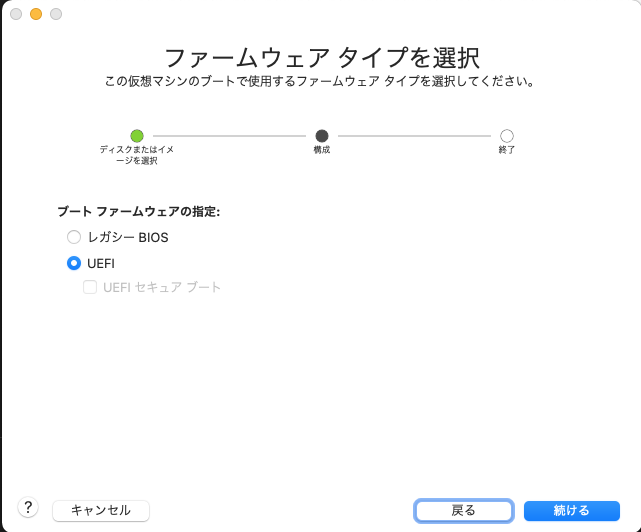

# Ubuntuの仮想環境をつくる

ROSで遊ぶにはUbuntu(Linux ディストリビューション)が欠かせない．
しかし，UbuntuがインストールされたPCを用意するのは大変なので，仮想環境(WindowsやMacなどのOSが実行されているPC上にソフトウェアによって仮想的なPCを構築したもの)を作成し，UbuntuをインストールしたのちにROSで遊べるようになるまでの環境構築の手順を紹介する．

1. 仮想環境を作成するためのソフトウェア  
    仮想環境の作成には以下のフリーソフトウェアを用いる．自身の環境に合わせてソフトウェアを選びインストールする．
    - Windows :  VMware Workstation Player  
        > https://www.vmware.com/jp/products/workstation-player/workstation-player-evaluation.html
    - Mac : VMware Fusion Player  
        VMware Fusion PlayerのダウンロードはVMwareのアカウントを登録し，個人ライセンスを取得する必要がある．
        また，取得した個人ライセンスはインストール時に必要なので，控えておく．
        > https://customerconnect.vmware.com/web/vmware/evalcenter?p=fusion-player-personal

    - Mac and Windows : Oracle VM VirtualBox
        > https://www.oracle.com/jp/virtualization/technologies/vm/downloads/virtualbox-downloads.html

    今回はMac上ででVMware Fusion Playerを用いてUbuntuの仮想環境を構築する手順を説明するが，WindowsのVMware Workstation PlayerやOracle VM VirtualBoxでの環境構築の手順もほとんど同じである．  
    また，Appleシリコン搭載のMacについては動作未検証である．

1. UbuntuのOSイメージを用意  
    ROSはUbuntuのバージョンによって使えるディストリビューションが異なるため，使いたいROSのディストリビューションに合わせてUbuntuのバージョンを選定する必要がある．  
    > http://wiki.ros.org/Distributions

    Ubuntuのバージョンが決まれば，配布サイトからISOイメージファイルをダウンロードする．
    - Ubuntu 18.04 LTS  
        JetsonでROSを使うことを想定している場合は，Jetsonの最新のOS(Jetpack 4系, 2022/3/16時点)が18.04ベースであるため，同じ18.04LTSをお勧めする．なお，ubuntu 18.04で実行可能なROS1のディストリビューションはmelodicである．ただし，ROS1 melodicではPython3を使うことができない点に注意が必要である．  
        ダウンロード :  
        > https://www.ubuntulinux.jp/News/ubuntu1804-ja-remix  

        (サーバーはどこでもOK)
    
    - Ubuntu 20.04 LTS  
        ひとまずROSを使ってみたい場合やROSのディストリビューションの制限がなければ，最新のROS Noeticが使える20.04LTSがお勧めである．ただし，システム要件がCPUが2GHz以上かつデュアルコア以上，メモリが4GB以上必要だとされているので，仮想環境を作成するPCがシステム要件の倍以上のスペックがない場合はお勧めできない．  
        ダウンロード :  
        > https://jp.ubuntu.com/download


1. 仮想マシンの作成
    VMware Fusion Playerを起動し，タブの "ファイル>新規"を選択し，仮想環境作成画面から指示に従って仮想環境を構築する．
    1. [ディスクまたはイメージからインストール]を選択し，[続ける]をクリック  
          

    1. ”新しい仮想マシンを作成"という画面が表示されたら，[別のディスクまたはディスクイメージを使用...]をクリックし，表示されたFinderウィンドウからダウンロードしたUbuntuのISOイメージファイルを選択し，[開く]をクリックした後，作成画面に戻り追加された.isoファイルを選択し，[続ける]をクリック  
          

    1. "簡易インストールを使用”のチェックを外し，[続ける]をクリック
          
    
    1. ファームウェア タイプは"UEIF"を選択し，[続ける]をクリック
        後にUbuntuをインストールする際に失敗する場合はレガシーBIOSに変更する  
          

    1. 作成される仮想マシンの概要(スペック)を確認した後，スペックを変更する場合は[設定のカスタマイズ]をクリックし，Finderウィンドウが表示されるので保存先を指定する．  
          
    
    1. 仮想マシンの実行画面と設定画面の２つのウィンドウが現れるので，設定画面から仮想マシンの詳細な設定を行う  
          

        主に設定を行うのは次の項目である．設定が完了したらウィンドウを閉じる．
         - [プロセッサとメモリ]  
            必要要件以上のスペックを設定する．プロセッサのコア数とメモリ容量はホストPC(今あなたが使っているPC)のスペックの半分程度までが上限(経験則)．
              

         - [ディスプレイ]  
            <font color="Red">インストールが途中で進まなくなるため，必ず”3Dグラフィクスの高速化"のチェックを外す．</font> インストール終了後に再度設定画面を開き，チェックをつけておくと良い．
              

         - [ハードディスク]  
            必要と思われる容量を指定する．ただし，Ubuntuのインストールには25GB以上必要であるため，ROSのインストールなども考慮して35GB以上をお勧めする．
              

    1. 仮想マシンを実行し，Ubuntuをインストール  
        仮想マシンの実行画面の再生マーク[▷]をクリックし仮想マシンを実行する．  
        <font color="Red">この時，キーボードとマウスの入力が仮想マシンへと移るので，ホストPCの操作が効かなくなるが，controlキーとcommandキーを同時に押せばホストPCへ操作を戻すことができるので，焦ってホストPCの強制終了などをしないように注意して欲しい．</font> 

        また，次のような画面が表示された場合は，矢印キーをの上下を使って[Ubuntu]を選択し，return(Enter)キーを押すと，少し待っていればUbuntuのインストール画面が表示される．
          

        GUIが起動しインストール画面が表示されたら，指示に従いインストールを進める．
        Ubuntuのバージョンによってインストール手順が若干異なるため，以降のインストール時の詳細な説明は省略するが，各バージョンで共通するインストール時の設定ポイントを挙げる．

        - 言語設定 : English
            英語でインストールしておかないと後にROSをインストールする際に障害となる
        - [Try Ubuntu]ではなく[Ubuntu install]を選択
        - キーボードレイアウト : Japanese > Japanese  
        - インストールオプション : Normal Install
        - インストールタイプ : Erase disk and install Ubuntu
        - 所在地 : Tokyo

        全ての設定を行い，インストールが完了すれば再起動し，Ubuntuのデスクトップが表示される．

    1. VMware toolsのインストール
        クリップボードの共有やファイル共有を有効にするために，vmware toolsという追加機能をインストールする．ターミナルを起動(control + option + T を同時に押す)し，以下のコマンドを入力する．

        ```
        $ sudo apt-get update
        $ sudo apt-get upgrade
        $ sudo apt install open-vm-tools-desktop
        $ sudo reboot
        ```

        2つ目のubuntuの更新コマンドは実行に時間がかかる．また，実行中にアプリケーションの更新等の実行をしても良いかの確認(YES/NO)の入力が要求される場合があるが，Yと入力しreturnを押すと進めることができる．全てのコマンドを入力し，再起動すれば仮想環境の準備は全て完了である．

    1. ROSをインストール
        ROSのインストールはディストリビューションごとに異なるため，公式インストール手順に従いインストールする．  
        インストール時のポイントとして，チュートリアル内のInstallationセクションでパッケージの選択肢があるが，基本的には”Desktop-Full Install”を選択すると良い．
        - ROS melodic  
            > http://wiki.ros.org/melodic/Installation/Ubuntu
        - ROS noetic  
            > http://wiki.ros.org/noetic/Installation/Ubuntu
        - ROS2 Crystal (Ubuntu 18.04)
            > https://docs.ros.org/en/crystal/Installation/Linux-Install-Binary.html#system-requirements
        - ROS2 Foxy (Ubuntu 20.04)
            > https://docs.ros.org/en/foxy/Installation/Ubuntu-Install-Binary.html#system-requirements
    
    1. catkin ワークスペースのセットアップ(ROS1のみ)
        ROS1のビルドシステムであるcatkinでROSパッケージをコンパイルするための環境を以下の公式チュートリアルに従い整える．チュートリアルでは最初にインストールしたROSのディストリビューションを選択する．  
        > http://wiki.ros.org/ja/catkin/Tutorials/create_a_workspace
        
        チュートリアルの手順に加えて，作成したワークスペースのパスを通すために以下のコマンドを実行する．
        ```
        $ echo "source ~/catkin_ws/devel/setup.bash" >> ~/.bashrc
        ```

        これで，Ubuntuの仮想環境作成とROS1の環境構築がすべて完了となる．  
        お疲れ様でした．


# 環境構築のオプション
- VMware Fusion PlayerでホストPCとUbuntu仮想環境間のファイル共有
    > http://verifiedby.me/adiary/0118  

- VMware Fusion PlayerでUbuntu実行中に英数キーを押すとCaps Lockが有効になるのが鬱陶しい問題の解決
    > https://www.netarium.jp/p-188/
